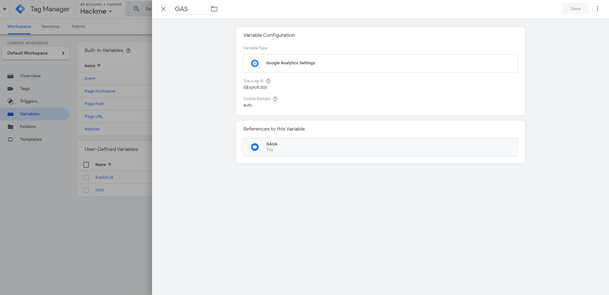

Hackme: Web hard - hxpctf 2020
===
This year I played hxp ctf w/ [mHACKeroni](https://mhackeroni.it)
## The challenge
The challenge is a [CodiMD](https://github.com/hackmdio/codimd) docker with report uri.
In the challenge, a note called "the-flag" exists and it contents, obv, the fl4g. This challenge is very very intresting, I loved it but the Dockerfile is really B1GG, with my orrible network it took ~15 minutes for build ahahah.  
(Solves: 15/1177, Fixed by CodiMD Team after issue [#1630](https://github.com/hackmdio/codimd/issues/1630), CVE-2020-26287)
## The bug
This challenge, obviously, has an XSS vuln mlmlmlml!\
Oh sh1t there is a CSP. I took a couple of minutes to analyze it
```
Content-Security-Policy: default-src 'self';script-src 'self' vimeo.com https://gist.github.com www.slideshare.net https://query.yahooapis.com 'unsafe-eval' https://disqus.com https://*.disqus.com https://*.disquscdn.com https://www.google-analytics.com 'nonce-90dfe8a7-eaa5-41a5-a9f2-7d36a6db7ce3' 'sha256-81acLZNZISnyGYZrSuoYhpzwDTTxi7vC1YM4uNxqWaM=';img-src * data:;style-src 'self' 'unsafe-inline' https://github.githubassets.com https://*.disquscdn.com;font-src 'self' data: https://public.slidesharecdn.com https://*.disquscdn.com;object-src *;media-src *;child-src *;connect-src *
```  
Eureka: `https://www.google-analytics.com` is enable.\
But first I need a method to include some script from google analytics :(\
With some osint I find a stored xss bug in [mermeid graph]( https://github.com/mermaid-js/mermaid/issues/869). 
## IT'S TIME TO EXPLOIT
With google analytics there is a service called "Google Tag Manager". With it I can create cusotm tag and custom javascript code.

First of all I write an XSS payload and create a variable in Google Tag Manager with this paylod.


Secondly I create a custom Google Universal Analytics Tag ang Google Analytics Settigs that took the custom variable and do something at the page load event




Finally I write a new note that trigger the xss bug:
```


And I report my note.

The flag: 
`
hxp{Yo dawg, I heard you like XSS, so I put some DOM injection in your script injection so you can inject scripts while you inject HTML while you inject scripts! Any questions?}
`.

Thanks a lot to orgs for the idea and for the other challenges.
